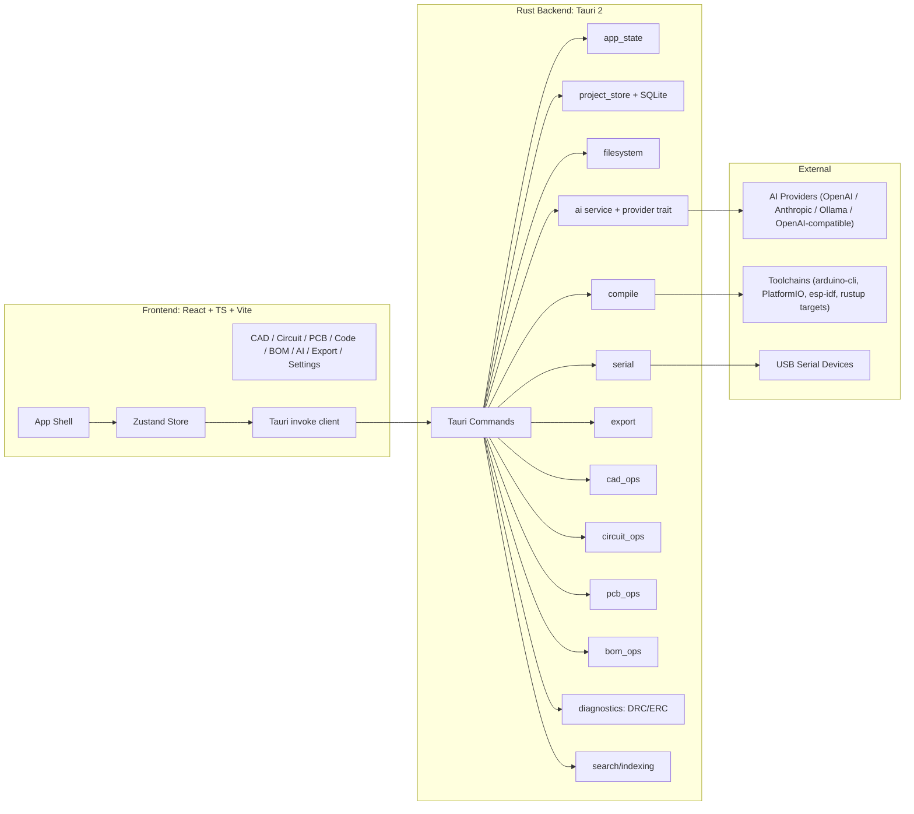
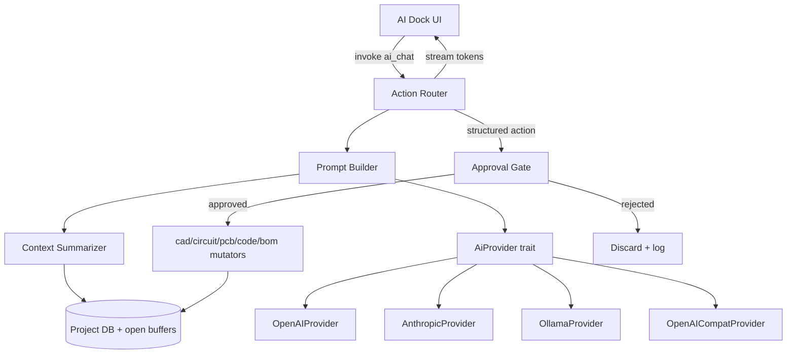

# Forge — Master Implementation Plan

> An AI-native hardware engineering IDE (CAD + Circuit + PCB + Code + BOM + AI + Serial + Export) built on Tauri 2 + Rust + React/TypeScript.
> Target: production-grade desktop app for Windows, macOS, and Linux.

This document is the single source of truth for building Forge. It is split into two parts:

- **Part A — Overall Plan**: architecture, tech, modules, data, AI design, design system, and quality bars.
- **Part B — Monthly Sequence (M0 → M12)**: ordered, step-by-step build with per-step testing and exit criteria so every milestone is independently runnable.

---

# PART A — OVERALL PLAN

## A0. Guiding Principles

1. **Desktop-first.** Rust owns truth. Frontend is the interface layer only.
2. **No broken intermediate states.** Every milestone ships a runnable app with green tests.
3. **Pluggable AI everywhere.** Provider is a swappable trait; AI write access goes through one approval-gated action router.
4. **Engineering-tool aesthetic.** Dense, precise, dark-by-default. No marketing UI inside the product.
5. **Performance budgets are non-negotiable.** Cold launch < 1.5s on M-class hardware, 60fps in common workflows, AI streams incrementally.
6. **Tests at every step.** No step is "done" without unit + integration coverage for the new surface area.

## A1. Architecture Overview



## A2. Tech Stack (locked)

- **Shell:** Tauri 2
- **Backend:** Rust (edition 2021), Tokio async runtime
- **Frontend:** React 18 + TypeScript 5, Vite 5
- **State:** Zustand (with `immer` middleware) + Zod for validation
- **UI:** Tailwind CSS with custom token layer + CSS variables
- **Icons:** `lucide-react`
- **Editor:** `monaco-editor` (loaded via `@monaco-editor/react`)
- **3D:** `three` + `@react-three/fiber` + `@react-three/drei`
- **2D diagrams:** SVG (schematic, block, ladder), Canvas/WebGL (PCB)
- **Markdown:** `react-markdown` + `remark-gfm` + `shiki` (code blocks)
- **Command palette:** `cmdk` + `fuse.js`
- **Resizable layout:** `react-resizable-panels`
- **DB:** SQLite via `rusqlite` (bundled) + `refinery` migrations
- **AI HTTP:** `reqwest` + `tokio-util` for SSE streaming
- **Secrets:** `keyring` crate (OS keychain) for API keys
- **Logging:** `tracing` + `tracing-subscriber` (Rust); `pino`-style structured logging in TS
- **Testing:** Vitest + Testing Library (FE); `cargo test` + `cargo nextest` (Rust); Playwright via Tauri WebDriver (E2E)
- **CI:** GitHub Actions, matrix on Windows / macOS (x64 + arm64) / Linux

## A3. Repository Layout (scaffolded in `/Users/sreeharshak/Dev/hardware/`)

```
hardware/
  prompt.md                # original spec
  plan.md                  # this file
  README.md
  package.json
  pnpm-lock.yaml
  tsconfig.json
  vite.config.ts
  tailwind.config.ts
  postcss.config.cjs
  index.html
  .github/workflows/
    ci.yml
    release.yml
  src/                     # frontend
    app/                   # AppShell, providers, router-shell
    components/            # generic primitives (Button, Tabs, Panel...)
    features/
      cad/
      circuit/
      pcb/
      code/
      bom/
      ai/
      export/
      settings/
      dashboard/
    lib/                   # ipc client, hotkeys, fuse helpers
    hooks/
    store/                 # zustand slices per workspace
    styles/                # tokens.css, globals.css
    types/                 # shared TS types (mirrored from Rust)
    test/                  # vitest setup, factories, mocks
  src-tauri/
    Cargo.toml
    tauri.conf.json
    build.rs
    icons/
    src/
      main.rs
      lib.rs
      commands/            # one file per command group
      app_state.rs
      project_store/
      filesystem/
      ai/                  # provider trait + impls
      serial/
      compile/
      export/
      cad_ops/
      circuit_ops/
      pcb_ops/
      bom_ops/
      diagnostics/         # erc, drc
      search/
      settings/
      schema/              # serde models shared via ts-rs
      migrations/          # SQL files for refinery
      errors.rs
      telemetry.rs
  assets/                  # bundled starter libraries (symbols, footprints, 3D)
    symbols/
    footprints/
    models/
    demo-project/
```

## A4. Rust Backend — Modules & Commands

### Modules
- `app_state` — global, lock-free where possible (`parking_lot::RwLock`), holds active project handle, AI session, serial sessions, settings.
- `project_store` — SQLite-backed persistence + on-disk project folder format. Migrations via `refinery`. Crash-safe atomic writes.
- `filesystem` — sandboxed FS helpers (path validation, project-relative resolution, watcher).
- `ai` — provider trait, prompt builder, context summarizer, action router, streaming.
- `serial` — `serialport` crate; port enumeration, async read/write tasks, event channel back to FE.
- `compile` — toolchain detection + invocation (arduino-cli, PlatformIO, cargo for embedded Rust); error parser.
- `export` — bundle/zip, CSV/XLSX/PDF (via `printpdf`), SVG/PNG, Gerber.
- `cad_ops` / `circuit_ops` / `pcb_ops` / `bom_ops` — pure-Rust mutation + validation helpers operating on project models.
- `diagnostics` — ERC (circuit) and DRC (PCB) engines.
- `search` — Tantivy-backed project-wide search index (files, nets, components, BOM).
- `settings` — typed settings, keychain-backed secrets.
- `schema` — single source of truth structs with `serde` + `ts-rs` to emit TS types.
- `errors` — typed `ForgeError` with `thiserror`, mapped to FE.

### Tauri Commands (final v1 surface)

Project / FS:
- `create_project`, `open_project`, `save_project`, `save_project_as`, `close_project`, `list_recent_projects`
- `read_file`, `write_file`, `rename_path`, `delete_path`, `list_dir`, `watch_path`

Settings & Secrets:
- `get_settings`, `set_settings`, `get_secret`, `set_secret`, `delete_secret`

Serial:
- `list_serial_ports`, `connect_serial`, `disconnect_serial`, `send_serial_data`
- emits events: `serial://data`, `serial://status`

Compile / Upload:
- `detect_toolchains`, `compile_firmware`, `upload_firmware`
- emits: `compile://log`, `compile://done`

Project Models (typed CRUD):
- `cad_apply_ops`, `circuit_apply_ops`, `pcb_apply_ops`, `bom_apply_ops`, `code_apply_ops`
- `get_project_context` (rich summary for AI)

Diagnostics:
- `run_erc`, `run_drc`, `auto_route` (heuristic v1)

Export:
- `export_project_bundle`, `export_bom_csv`, `export_bom_xlsx`, `export_bom_pdf`
- `export_schematic_svg`, `export_block_svg`, `export_ladder_pdf`, `export_pcb_gerbers`, `export_pcb_image`, `export_cad_screenshot`, `export_design_review`

AI:
- `ai_list_providers`, `ai_set_provider`, `ai_test_connection`
- `ai_chat` (streaming via events `ai://delta`, `ai://done`, `ai://action`)
- `ai_apply_patch` (approval-gated), `ai_revert_patch`
- `ai_generate_code`, `ai_generate_schematic`, `ai_generate_block_diagram`, `ai_generate_scene`, `ai_design_review`

All commands return `Result<T, ForgeError>`; errors carry `code`, `message`, `details?`.

## A5. Frontend — Feature Map

- `app/AppShell.tsx` — title bar, activity rail, secondary sidebar, main panel, right inspector, bottom dock, status bar.
- `app/Router.tsx` — in-shell workspace router preserving per-workspace state.
- `features/dashboard/` — recent projects, templates, demo project entry.
- `features/cad/` — Three.js viewport, object tree, gizmos, primitive/library palette, inspector.
- `features/circuit/` — mode switcher (schematic/breadboard/block/ladder), symbol palette, SVG canvas, net inspector, ERC panel.
- `features/pcb/` — canvas board view, layer panel, footprint palette, route/via/zone tools, DRC panel, 3D preview.
- `features/code/` — Monaco multi-tab editor, file tree, problems panel, compile/upload bar, serial monitor.
- `features/bom/` — virtualized table, filters, sourcing widget, export menu.
- `features/ai/` — dock panel (chat, actions, diffs, approvals), persona switcher, provider/model selector.
- `features/export/` — wizard with validation, progress, artifact list.
- `features/settings/` — categorized settings, provider/key manager, shortcut editor.
- `lib/ipc.ts` — typed `invoke` wrappers generated from Rust schema (via `ts-rs`).
- `lib/hotkeys.ts` — global keymap, per-workspace overrides, OS-aware labels.
- `lib/palette.ts` — command registry + Fuse index.
- `store/` — slices: `project`, `cad`, `circuit`, `pcb`, `code`, `bom`, `ai`, `serial`, `compile`, `settings`, `ui`.

## A6. Data Model & SQLite Schema

Project is stored as **a folder on disk** plus a single `forge.db` SQLite file inside the project for indexed/queryable data. Binary/large assets live as files; the DB holds structured graphs and metadata.

Core tables (final v1):
- `project(id, name, description, created_at, updated_at, board_target, units, tags_json, ai_persona, settings_json, schema_version)`
- `cad_object(id, parent_id, name, kind, transform_json, material_json, locked, hidden, metadata_json)`
- `cad_view(id, name, camera_json)`
- `circuit_component(id, ref, value, symbol_id, footprint_id, props_json, x, y, rotation, mirrored, mode)`
- `circuit_pin(id, component_id, name, number, x, y, electrical_type)`
- `circuit_wire(id, net_id, points_json, mode)`
- `circuit_net(id, name, class)`
- `circuit_annotation(id, kind, payload_json, x, y)`
- `pcb_layer(id, name, kind, color, visible)`
- `pcb_footprint(id, component_ref, library_id, x, y, rotation, side)`
- `pcb_pad(id, footprint_id, name, net_id, shape_json, layer_mask)`
- `pcb_trace(id, net_id, layer_id, points_json, width)`
- `pcb_via(id, net_id, x, y, layers_json, drill, diameter)`
- `pcb_zone(id, net_id, layer_id, polygon_json, clearance)`
- `pcb_outline(id, polygon_json)`
- `bom_item(id, ref_designators_json, value, package, description, qty, unit_price, supplier, supplier_pn, stock, notes, substitute_for)`
- `code_file(path, last_modified, size, language)` — index only; bytes on disk.
- `ai_session(id, started_at, persona, provider, model)`
- `ai_message(id, session_id, role, content, tokens_in, tokens_out, created_at)`
- `ai_action(id, session_id, kind, payload_json, status, applied_at, reverted_at)`
- `event_log(id, kind, payload_json, created_at)` — for autosave/recovery + AI history.
- `recent_project(path, opened_at)` — stored in **user-level** DB, not project DB.

Migrations are versioned and forward-only. Every release bumps `schema_version` if needed.

## A7. Pluggable AI Architecture



Core elements:

- `trait AiProvider` exposes: `chat_stream(req) -> Stream<ChatDelta>`, `embed(text) -> Vec<f32>` (optional), `capabilities() -> ProviderCaps`.
- Providers ship as separate modules under `src-tauri/src/ai/providers/`. Selecting a provider is a runtime choice from Settings.
- API keys are stored via `keyring` (never in the DB, never sent to frontend). Frontend only sees redacted previews like `sk-...abcd` and an `is_set: true` flag.
- All AI writes go through one `ai_apply_patch` command, which:
  1. Validates the action against a Zod-mirrored Rust schema.
  2. Computes a preview diff (textual diffs for code, structural diffs for CAD/circuit/PCB/BOM).
  3. Persists a pending `ai_action` row.
  4. Requires explicit user approval (or auto-approves "safe" classes user has opted-in to).
  5. Applies via the relevant `*_ops` mutator inside a SQLite transaction with a backup snapshot.
  6. Emits `event_log` entries so any change can be reverted.
- Context summarizer feeds the LLM only what's relevant to the current task and stays within token budget per provider/model.
- Personas (`Mentor`, `Engineer`, `Student Helper`) are system prompts + tool-allowlist presets.

## A8. Design System & Tokens

CSS variables defined in `src/styles/tokens.css`:

```css
:root {
  --bg-0: #0b0d0e;
  --bg-1: #111416;
  --bg-2: #161a1d;
  --surface-1: #1a1f23;
  --surface-2: #20262b;
  --border-1: #262d33;
  --border-2: #303841;
  --text-1: #e6edf3;
  --text-2: #a8b3bd;
  --text-3: #6b7681;
  --accent: #2dd4bf;          /* teal */
  --accent-soft: rgba(45,212,191,0.12);
  --warn: #f59e0b;
  --error: #ef4444;
  --ok: #10b981;
  --radius-1: 4px;
  --radius-2: 6px;
  --radius-3: 10px;
  --space-1: 4px;
  --space-2: 8px;
  --space-3: 12px;
  --space-4: 16px;
  --space-5: 24px;
  --space-6: 32px;
  --shadow-1: 0 1px 2px rgba(0,0,0,0.4);
  --shadow-2: 0 6px 24px rgba(0,0,0,0.5);
  --dur-fast: 120ms;
  --dur-med: 200ms;
  --z-base: 0;
  --z-overlay: 50;
  --z-modal: 100;
  --z-toast: 200;
}
```

Typography:
- Body: Inter (fallback system-ui)
- Display: Cabinet Grotesk (fallback Inter)
- Mono: JetBrains Mono (fallback ui-monospace)

Component grammar: every interactive element has `default / hover / active / focus-visible / disabled` states. Selection highlight is the same teal across CAD, circuit, PCB, and code.

## A9. Cross-Cutting Quality Bars

- **Performance:** cold launch < 1.5s; workspace switch < 80ms; palette open < 100ms; PCB pan/zoom holds 60fps with 5k pads; CAD 60fps with 200 objects.
- **Reliability:** autosave every 10s + on blur; crash recovery from the last `event_log` snapshot.
- **Security:** API keys only in OS keychain; all FS access path-validated; Tauri allowlist locked to what's used.
- **Accessibility:** all interactive controls keyboard reachable; focus rings always visible; reduced-motion respected.
- **Observability:** structured logs to `~/Library/Logs/Forge/` (mac), `%APPDATA%/Forge/logs/` (win), `~/.local/state/forge/logs/` (linux). Log levels configurable.
- **i18n-ready:** strings go through a `t()` helper from day one; English-only at v1.

## A10. Phasing Strategy

Twelve calendar months, each ending in a tagged release (`v0.1` ... `v1.0`). Each month follows the same shape: **Plan → Build (ordered steps with per-step tests) → Integrate → QA gate → Demo → Tag**. No month is started until the previous month's exit criteria are green.

---

# PART B — MONTHLY SEQUENCE (M0 → M12)

> Each month lists **Goal**, **Ordered Steps** (each with the test required to "close" the step), and **Exit Criteria**. Treat steps as a strictly ordered todo list. A step is only "done" when its tests pass in CI on all three OS targets unless explicitly scoped otherwise.

---

## M0 — Foundations & Scaffold (Weeks 1–2)

**Goal:** A Tauri 2 app that opens to an empty themed shell, with CI green on all OSes.

**Ordered Steps**

1. Initialize repo at `/Users/sreeharshak/Dev/hardware/`.
   - Test: `pnpm install` and `pnpm tauri info` succeed locally.
2. Scaffold Tauri 2 + Vite + React + TS via `pnpm create tauri-app`.
   - Test: `pnpm tauri dev` launches a window on macOS.
3. Add Tailwind + `tokens.css` + base fonts.
   - Test: snapshot test of `<AppShell />` renders with dark tokens (Vitest + RTL).
4. Add ESLint, Prettier, `tsc --noEmit`, `cargo fmt`, `cargo clippy -D warnings`.
   - Test: `pnpm lint && pnpm typecheck && cargo clippy` all clean.
5. Add `tracing` + `tracing-subscriber` in Rust with file + stdout sinks under platform log dirs.
   - Test: Rust unit test asserts log file is created at expected path on tmpdir.
6. Add Vitest setup; add `cargo nextest` profile.
   - Test: a trivial FE test and a trivial Rust test run in CI.
7. GitHub Actions `ci.yml`: matrix `ubuntu-latest`, `macos-14`, `windows-latest`; runs lint, typecheck, tests, `cargo build --release` smoke.
   - Test: PR shows all three jobs green.
8. Add `ts-rs` to emit TS types from Rust `schema` module; wire into build.
   - Test: generated `src/types/generated.ts` matches a snapshot.
9. Add `keyring` crate; implement `get_secret`/`set_secret`/`delete_secret` commands behind a feature-flagged dev mock.
   - Test: integration test reads/writes a fake key in a temp keyring (mac/linux/win conditional).
10. Implement `AppShell` skeleton: titlebar, activity rail (icons only), empty workspace area, bottom dock placeholder, status bar.
    - Test: RTL test verifies activity rail renders all 9 workspace icons with correct `aria-label`s.

**Exit Criteria**
- `pnpm tauri dev` opens themed shell on all 3 OSes.
- CI green; coverage report published.
- Tagged `v0.1.0-foundations`.

---

## M1 — Project Persistence & App Shell State (Month 1)

**Goal:** Create/open/save real projects on disk + SQLite. Activity rail switches workspaces with preserved state. Command palette works.

**Ordered Steps**

1. Define `schema` Rust module with `Project`, `Settings`, `RecentProject` (ts-rs exported).
   - Test: Rust round-trip serde test for each.
2. Wire `rusqlite` + `refinery` migrations. Add `0001_init.sql` with `project`, `event_log`, `recent_project`.
   - Test: migration test on fresh + upgrade paths.
3. Implement `project_store`: `create_project(path, name)`, `open_project(path)`, `save_project`, `close_project`, `list_recent_projects`.
   - Test: integration tests using `tempfile` for each command; assert on-disk layout (`forge.db`, `forge-project.json`, subfolders).
4. Implement atomic save (write to `.tmp` → fsync → rename) and event-log snapshotting.
   - Test: kill-9 simulation (drop file mid-write) leaves a valid prior state.
5. Implement Zustand `projectSlice` + typed IPC wrappers in `src/lib/ipc.ts`.
   - Test: FE test mocks `invoke` and asserts state transitions on `openProject`.
6. Build `Dashboard` workspace: recent projects, New, Open, Open Demo (placeholder), Templates list.
   - Test: RTL test for empty + populated recents.
7. Implement `Router` with state preservation per workspace using Zustand slices.
   - Test: switch CAD ↔ Code ↔ Settings; assert dummy state survives.
8. Implement Command Palette with `cmdk` + `fuse.js`. Register navigation, project, and settings commands.
   - Test: keyboard-driven test: `Cmd/Ctrl+K`, type "Open", Enter triggers `openProject` IPC.
9. Implement global hotkey system with OS-aware labels.
   - Test: snapshot test of `Cmd+K` vs `Ctrl+K` rendering.
10. Implement Settings workspace v1 (General + Appearance). Persist to user-level SQLite.
    - Test: change theme, restart app (simulated), value persists.
11. Implement autosave timer (10s + on blur) writing to `event_log`.
    - Test: time-travel test asserts snapshot rows accumulate.

**Exit Criteria**
- User can create, save, close, reopen a project; recents populate.
- Palette opens < 100ms on cold app.
- Tagged `v0.2.0-shell`.

---

## M2 — Code Workspace + Serial (Month 2)

**Goal:** Real multi-tab Monaco editor backed by the project filesystem; working serial monitor.

**Ordered Steps**

1. Implement `filesystem` module with path validation and a `notify`-based watcher; commands `read_file`, `write_file`, `list_dir`, `rename_path`, `delete_path`, `watch_path` (event-emitting).
   - Test: integration tests for happy path + traversal attempts (`..`) rejected.
2. Add Monaco via `@monaco-editor/react`; multi-tab model with dirty-state tracking.
   - Test: open two files, edit one, switch tabs; dirty marker persists.
3. Implement file tree component (virtualized) over `list_dir` + watcher events.
   - Test: add/rename/delete reflect within 200ms in test harness.
4. Implement Problems panel (empty for now; wired to a `diagnostics::push(file, range, severity)` channel).
   - Test: synthetic diagnostic appears, click navigates to range.
5. Implement Find/Replace in current file and project-wide search powered by a Rust `search` index (Tantivy).
   - Test: search "TODO" across fixtures returns correct hits.
6. Implement language detection + Monaco language selection for `.ino`, `.cpp`, `.c`, `.h`, `.py`, `.rs`, `.json`, `.yaml`, `.toml`, `.md`.
   - Test: parametric test verifying language per extension.
7. Add `serial` module with `serialport` crate; commands `list_serial_ports`, `connect_serial`, `disconnect_serial`, `send_serial_data`; emit `serial://data` events.
   - Test: mock serial provider behind a trait; integration test asserts round-trip bytes.
8. Implement Serial Monitor UI in bottom dock (tab alongside Problems): port + baud picker, timestamping, autoscroll, send line.
   - Test: RTL test asserts received line renders with timestamp.
9. Board profiles (Uno/Nano/Mega/ESP32/ESP8266/Pico/STM32 generic) persisted to project + settings.
   - Test: choose profile, reopen project, profile retained.
10. Connection/upload status indicators in status bar.
    - Test: state machine test for `idle → connecting → connected → error → reconnect`.

**Exit Criteria**
- Open a folder of source files, edit/save reliably, search works.
- Connect to a real or mocked serial device and see lines stream.
- Tagged `v0.3.0-code`.

---

## M3 — Pluggable AI System (Month 3)

**Goal:** Working AI dock with provider plug-in: OpenAI, Anthropic, Ollama, OpenAI-compatible. Approval-gated code patching ships first.

**Ordered Steps**

1. Define `AiProvider` trait + `ProviderCaps` + `ChatRequest` / `ChatDelta` types in `src-tauri/src/ai/mod.rs`.
   - Test: trait object dyn-compat test compiles.
2. Implement `OpenAIProvider` using `reqwest` + SSE streaming.
   - Test: against a recorded fixture HTTP server (`wiremock`), asserts streamed deltas decode correctly.
3. Implement `AnthropicProvider`.
   - Test: as above with Anthropic SSE format.
4. Implement `OllamaProvider` (local HTTP).
   - Test: as above with Ollama NDJSON.
5. Implement `OpenAICompatProvider` (generic OpenAI-compatible endpoint).
   - Test: as above.
6. Implement provider registry + `ai_list_providers`, `ai_set_provider`, `ai_test_connection`.
   - Test: switch providers, `ai_test_connection` returns ok/err.
7. Wire API keys to `keyring`; ensure secrets never cross IPC; FE shows only redacted preview.
   - Test: assert no plaintext key in any IPC response payload.
8. Implement `Prompt Builder` + `Context Summarizer` (read-only access to project DB and open buffers).
   - Test: golden-file test on a fixture project yields expected context payload under token budget.
9. Implement `Action Router` with action schema (start with code actions: `create_file`, `update_file`, `delete_file`, `patch_range`).
   - Test: malformed action rejected; valid action produces preview diff.
10. Implement AI dock UI: streaming markdown, code blocks (shiki), copy button, action cards with "Preview Diff / Approve / Reject".
    - Test: RTL test asserts streaming text appends and action card renders.
11. Implement `ai_apply_patch` with snapshot + revert via `event_log`.
    - Test: apply then `ai_revert_patch` returns file bytes to prior state.
12. Personas (Mentor / Engineer / Student Helper) as system-prompt + allowlist presets.
    - Test: persona change reflects in next request payload.
13. Provider/model selector in Settings → AI; per-project override.
    - Test: setting persists per project and per user.

**Exit Criteria**
- User adds a provider key, chats, asks for a code change, previews diff, approves, reverts.
- All providers covered by unit tests against recorded fixtures.
- Tagged `v0.4.0-ai-core`.

---

## M4 — Circuit Workspace: Schematic Mode (Month 4)

**Goal:** Functional schematic editor with symbol library, wiring, ERC, and AI hooks.

**Ordered Steps**

1. Define `circuit` schema (components, pins, wires, nets, annotations) + migrations.
   - Test: serde + DB round-trip.
2. Ship starter symbol library JSON under `assets/symbols/` (resistor, cap, inductor, diode, zener, LED, NPN, PNP, NMOS, PMOS, op-amp, regulator, switch, button, relay, buzzer, motor, battery, headers, GND, VCC, +3V3, +5V, VIN, Uno/Nano/Mega/ESP32/Pico, common sensors).
   - Test: schema-validate every symbol on startup.
3. Build SVG canvas with pan/zoom, snap grid, marquee selection.
   - Test: visual regression with Playwright on fixture scene.
4. Implement symbol palette + drag-place with pin-aware snapping.
   - Test: drop component; assert pin coordinates align to grid.
5. Implement orthogonal wire tool with auto-corner; junction dots auto-created.
   - Test: connect two pins, assert net coalesces wires + creates net id.
6. Implement net labels, reference designators (auto-increment), component values, rotation/mirror, annotations.
   - Test: rotate symbol; pin positions update correctly.
7. Implement `circuit_ops::run_erc` in Rust: floating pins, missing power, short-to-power, duplicate refs, unconnected required pins.
   - Test: fixture-driven ERC tests; severity correct.
8. Implement ERC panel in bottom dock with jump-to-issue.
   - Test: click issue, viewport scrolls and selects offender.
9. Extend Action Router with circuit actions: `add_component`, `remove_component`, `move_component`, `add_wire`, `remove_wire`, `rename_net`, `set_value`.
   - Test: action validation + transactional apply + revert.
10. AI: "generate circuit from prompt" — produces structured actions, previewed before apply.
    - Test: fixture prompt yields expected component+wire actions.
11. Inspector panel for selected component(s) with bulk edit.
    - Test: multi-select edit value updates all.
12. Export schematic SVG/PNG via Rust render.
    - Test: golden image comparison.

**Exit Criteria**
- Build a working schematic for the Temperature Monitor demo end-to-end with ERC clean.
- Tagged `v0.5.0-schematic`.

---

## M5 — Circuit: Breadboard + Block + Ladder Modes (Month 5)

**Goal:** Round out circuit module with three additional diagram modes sharing the unified data model.

**Ordered Steps**

1. Add `mode` discriminator already in schema; add per-mode layout tables (`circuit_layout_breadboard`, `_block`, `_ladder`).
   - Test: migration + serde.
2. Breadboard renderer: tie-point grid, rails, jump wires with color, electrical awareness shared with schematic nets.
   - Test: place wire across a strip; assert continuity to all tied pins.
3. Block diagram: draggable blocks, categorized colors, directional connections, port labels, protocol labels, swimlanes.
   - Test: build a fixture block diagram; export SVG matches golden.
4. Ladder diagram: contacts/coils/timers/counters/function blocks, rungs, symbolic variable table.
   - Test: simulate energized state on fixture rung table.
5. Mode switcher in the workspace toolbar; preserve selection where possible.
   - Test: schematic ↔ breadboard ↔ block ↔ ladder retains undo stack per mode.
6. AI actions for each mode: convert schematic → block diagram; suggest breadboard layout from schematic; generate ladder rungs from a description.
   - Test: action golden-files per mode.
7. Exports: SVG/PNG (block/breadboard), PDF/PNG (ladder).
   - Test: deterministic filename + content check.

**Exit Criteria**
- All four circuit modes functional with at least one AI action each.
- Tagged `v0.6.0-circuit-full`.

---

## M6 — PCB Workspace (Month 6)

**Goal:** Real PCB editor with layers, routing, DRC, 3D preview, and Gerber export.

**Ordered Steps**

1. Define `pcb` schema (layers, footprints, pads, traces, vias, zones, outline, design rules) + migrations.
   - Test: round-trip.
2. Implement Canvas/WebGL board view with pan/zoom, snap grid, layer-tinted rendering.
   - Test: perf test pans/zooms a 5k-pad fixture at ≥ 60fps in headless GL.
3. Ship starter footprint library JSON (DIP, QFP, SOIC, SOT-23, 0402/0603/0805, headers, USB, terminal blocks, Arduino shield, ESP32 dev board, mounting holes).
   - Test: schema-validate at startup.
4. Footprint placement + rotation + side switch; netlist linkage from circuit data.
   - Test: place footprint of a circuit ref; pads inherit nets.
5. Trace routing tool with width classes, layer switching via via.
   - Test: route a net across two layers; via inserted correctly.
6. Via and zone tools; keepouts; board outline editor.
   - Test: zone fills around obstacles; clearance respected in DRC.
7. Ratsnest computation in Rust; live update on edit.
   - Test: ratsnest length decreases as traces complete.
8. Implement `pcb_ops::run_drc`: clearance, width, unrouted, via-in-pad (configurable), silkscreen overlap.
   - Test: fixture violations enumerated correctly.
9. AI PCB actions: propose placement (heuristic), suggest decoupling near IC power pins, flag crowded regions, auto-route trivial single-net cases.
   - Test: action golden-files on a small fixture.
10. 3D preview via `three`: extrude board outline, place component boxes from footprint metadata, board color choices.
    - Test: snapshot of preview camera.
11. Exports: Gerbers (RS-274X), drill files (Excellon), pick-and-place CSV, BOM-link, board image PNG.
    - Test: byte-stable Gerber output against golden files for a small fixture.

**Exit Criteria**
- Place + route the Temperature Monitor demo to a 2-layer board with clean DRC and exportable Gerbers.
- Tagged `v0.7.0-pcb`.

---

## M7 — CAD Workspace (Month 7)

**Goal:** 3D assembly workspace with primitives, hardware library, gizmos, snapping, and AI scene actions.

**Ordered Steps**

1. Define `cad` schema (objects, transforms, materials, hierarchy, named views) + migrations.
   - Test: round-trip.
2. Three.js + R3F viewport with orbit/pan/zoom, grid + axis helpers, configurable units.
   - Test: snapshot a default scene.
3. Primitive library (box, cylinder, sphere, cone, torus, plane, rounded box, simple extrusion).
   - Test: add each, inspector shows correct dims.
4. Hardware library starter assets (Uno, Nano, breadboard, servo, DC motor, stepper, ultrasonic, IR, LED, resistor pack, battery pack, standoff, enclosure shell, screw, connector). Use lightweight GLTFs bundled under `assets/models/`.
   - Test: load every asset; bounding box non-zero.
5. Selection + transform gizmos (translate/rotate/scale) with snapping.
   - Test: drag along axis snaps to grid increments.
6. Object tree (visibility/lock/group/ungroup/duplicate/delete) + inspector (transform, material, transparency, notes, tags).
   - Test: group two objects, transform parent moves children.
7. Named views + screenshot export.
   - Test: save view, restore camera within epsilon.
8. Measurements + collision overlap warnings (AABB v1).
   - Test: overlapping boxes flagged.
9. AI CAD actions: add object by prompt, place by coordinates, rename, generate enclosure around selection, suggest internal spacing, describe scene.
   - Test: golden-file action outputs.

**Exit Criteria**
- Build a 3D assembly of the demo (board + sensor + enclosure) with at least one AI-generated enclosure pass.
- Tagged `v0.8.0-cad`.

---

## M8 — BOM + Export Pipeline (Month 8)

**Goal:** BOM workspace aggregating circuit + PCB data; comprehensive export pipeline.

**Ordered Steps**

1. Define `bom` schema; aggregator that derives initial items from `circuit_component` + `pcb_footprint`.
   - Test: fixture produces deterministic BOM rows.
2. Virtualized BOM table (`@tanstack/react-virtual`) with inline edit, sort, filter, group, dedupe.
   - Test: 10k rows render and scroll smoothly.
3. Sourcing widget v1: pluggable supplier interface; ship a mock supplier first; document an extension point for real APIs.
   - Test: mock supplier returns deterministic results.
4. Substitutes, stock status, pricing snapshots, notes; missing-metadata warnings.
   - Test: warnings list matches expectations.
5. AI BOM actions: optimize cost, suggest alternates, standardize passives, flag obsolete, JLC/LCSC-friendly mode toggle.
   - Test: action goldens.
6. Exports: CSV, XLSX (`rust_xlsxwriter`), PDF (`printpdf`).
   - Test: structural assertions on outputs.
7. Project Bundle Export: zip with `forge-project.json`, db snapshot, all exports, optional source code, optional generated artifacts.
   - Test: re-open exported bundle round-trips.
8. Schematic SVG/PNG, Block SVG/PNG, Ladder PDF/PNG, PCB Gerbers/image, CAD screenshots, AI Design Review report (Markdown + PDF).
   - Test: each export produces a non-empty, schema-valid artifact.
9. Export wizard UI with validation, progress, warning surfacing, deterministic filenames, custom destination.
   - Test: cancel mid-export cleans temp files.

**Exit Criteria**
- One-click "Export Everything" produces a complete fabrication + dev bundle for the demo.
- Tagged `v0.9.0-bom-export`.

---

## M9 — Compile + Upload Toolchain (Month 9)

**Goal:** Real firmware compilation and upload via detected toolchains; diagnostics map back to Monaco.

**Ordered Steps**

1. Implement `detect_toolchains`: probes for `arduino-cli`, `pio`, `idf.py`, `rustup` embedded targets, `python` for MicroPython/CircuitPython tooling.
   - Test: mocked PATH probes produce correct capability matrix.
2. Compile invocation per board profile via async `tokio::process`; stream stdout/stderr to FE via `compile://log`.
   - Test: integration test with a fixture toolchain stub.
3. Error parser per toolchain → unified diagnostic format → Monaco markers.
   - Test: parametric tests over saved compiler output fixtures.
4. Upload flow: build → reset device → flash → verify; UI status states.
   - Test: state-machine test over mocked steps.
5. Diagnostics panel groups by severity + file; click-to-jump.
   - Test: UI test for grouping and navigation.
6. Setup guidance: if toolchain missing, surface a clear how-to-install panel with platform-specific commands.
   - Test: missing-toolchain banner renders with correct copy per OS.
7. AI code actions tied into compile errors: "Fix this error" runs an LLM patch proposal targeted at the diagnostic.
   - Test: fixture error → action proposes a patch covering the failing range.

**Exit Criteria**
- Compile + upload the demo firmware to a real or simulated Uno/ESP32; failing compile shows inline markers; "Fix with AI" works end-to-end.
- Tagged `v0.10.0-toolchain`.

---

## M10 — Demo Project, Onboarding, Polish (Month 10)

**Goal:** First-launch greatness. Crash-safe. Accessible. Fast.

**Ordered Steps**

1. Build and bundle "Temperature Monitor v1" demo under `assets/demo-project/`: CAD assembly, schematic, block diagram, small PCB, firmware, BOM, sample AI suggestions.
   - Test: on first launch, "Open Demo" loads with all workspaces populated.
2. Onboarding tour (dismissible, keyboard navigable, reduced-motion aware).
   - Test: a11y audit passes with `axe-core` in Playwright.
3. Crash recovery: on launch, detect orphaned `event_log` tail; offer "Restore last session".
   - Test: simulate crash mid-edit; restart restores within tolerance.
4. Performance pass: measure cold launch, palette latency, PCB pan/zoom FPS, CAD FPS, AI streaming latency. Fix regressions.
   - Test: perf budgets checked in CI via Playwright timing assertions.
5. Accessibility pass: focus rings everywhere, semantic roles, screen-reader labels on critical actions, color-contrast audit, reduced-motion toggle, large-target option.
   - Test: `axe-core` zero serious issues; manual VoiceOver/Narrator/Orca smoke checklist.
6. Polish: consistent radius scale, spacing, empty states, error states, loading states, modal hygiene.
   - Test: visual regression suite over key screens.
7. Telemetry: opt-in only, anonymous, off by default; document categories.
   - Test: ensure no network egress when disabled.

**Exit Criteria**
- First-launch experience demonstrates the full product loop in under 2 minutes.
- Tagged `v0.11.0-polish`.

---

## M11 — QA, Security, Hardening (Month 11)

**Goal:** Earn the "no-errors, no-bugs" bar via systematic testing and threat modeling.

**Ordered Steps**

1. Frontend unit + component coverage to ≥ 80% lines on `lib/`, `store/`, and every workspace's reducers/utilities.
   - Test: coverage gate in CI.
2. Rust unit + integration coverage to ≥ 80% on `project_store`, `*_ops`, `diagnostics`, `export`, `ai::action_router`.
   - Test: coverage gate via `cargo llvm-cov`.
3. E2E suite (Playwright over Tauri WebDriver) for the canonical flows:
   - create/open/save project
   - switch workspaces
   - schematic → ERC → fix
   - PCB → route → DRC → Gerber export
   - CAD enclosure generate
   - AI generate code + apply + revert
   - compile + upload + serial monitor
   - export everything
   - crash + restore
   - Test: all flows pass on all 3 OS runners.
4. Migration tests across every schema version.
   - Test: upgrade `v0.1.0` fixtures to `v1.0.0` without data loss.
5. Threat-model + fix: IPC input validation, FS sandboxing, AI key isolation, Tauri allowlist minimization, supply chain (`cargo audit`, `pnpm audit`).
   - Test: audits clean; allowlist diff reviewed.
6. Fuzz critical parsers (project JSON, netlist import, error parser) with `cargo fuzz`.
   - Test: 1h fuzz run yields no crashes.
7. Internationalization-readiness review (no hardcoded strings in render paths).
   - Test: lint rule + audit script.
8. Localization: ship English only; verify pipeline by adding a stub locale.
   - Test: switch to stub locale, key fallbacks visible.

**Exit Criteria**
- All canonical flows pass on 3 OSes in CI; audits clean; coverage gates met.
- Tagged `v0.12.0-rc`.

---

## M12 — Release Engineering (Month 12)

**Goal:** Ship `v1.0` with installers, signing, updates, and docs.

**Ordered Steps**

1. App icons + brand pack across all platform sizes.
   - Test: icon validators (iconutil/png parity).
2. Tauri bundler config tuned per OS; produce `.msi`, `.dmg`, `.deb`, `.AppImage`.
   - Test: install + launch from artifact on each OS in CI VM.
3. Signing: macOS notarization, Windows code signing via certs in CI secrets.
   - Test: notarization staple verified; SmartScreen reputation tracked.
4. Auto-update plan via Tauri updater; staged rollout channels (`stable`, `beta`).
   - Test: update from `v0.99.0` → `v1.0.0` simulated.
5. Documentation: user guide (Markdown site or in-app help), keyboard cheatsheet, AI provider setup guide, troubleshooting (toolchains, drivers).
   - Test: docs build clean, links checked.
6. Changelog + release workflow (`release.yml`) triggered on tag, builds + signs + uploads artifacts + publishes notes.
   - Test: dry-run tag produces full artifact set.
7. Post-release plan: bug intake template, hotfix branch policy, SLA for security issues, feedback channel.
   - Test: open a sample issue end-to-end through templates.

**Exit Criteria**
- `v1.0.0` installers on all 3 platforms; auto-update path validated; user docs published.
- Tagged `v1.0.0`.

---

# C. Risks & Mitigations

- **Scope risk.** This is genuinely a multi-team product. Mitigation: monthly tags, strict exit criteria, AI write surfaces opt-in per workspace before that workspace's M-month closes.
- **PCB DRC/Gerber correctness.** Mitigation: golden-file tests, public KiCad fixtures as a sanity reference; mark Gerber export "experimental" until a clean roundtrip on three fixtures.
- **Cross-platform toolchains.** Mitigation: detect-only by default; never auto-install; clear setup docs per OS.
- **AI nondeterminism.** Mitigation: structured actions over free-form patches; always preview + approve; record `ai_action` rows for audit.
- **Performance creep.** Mitigation: perf budgets enforced in CI from M0.
- **Security of AI write access.** Mitigation: approvals required, snapshots before apply, one-click revert, allowlist of action kinds per persona.

---

# D. Definition of Done — v1.0

- Can create a hardware project from scratch in Forge: CAD assembly, schematic, breadboard, block diagram, PCB, firmware, BOM, exports.
- Pluggable AI (OpenAI / Anthropic / Ollama / OpenAI-compatible) with structured, approval-gated write access across every workspace.
- 60fps in standard workflows on commodity laptops; cold launch < 1.5s; palette < 100ms.
- Crash-safe autosave + restore; no data loss across workspace switches.
- Installers signed on Windows + macOS; Linux packages provided; auto-update channel live.
- Tests green on all 3 OSes; coverage gates met; audits clean; canonical E2E flows pass.
- "Temperature Monitor v1" demo ships in-box and exercises the full product in under 2 minutes.

---

# E. How to Use This Plan

1. Treat months as ordered. Do not start M(n+1) until M(n) exit criteria are green in CI.
2. Inside each month, treat steps as a strictly ordered todo. Each step closes only with its test passing.
3. Any new step added mid-month must come with its own test.
4. Anything not in this plan is out of scope for v1.0 unless promoted via an explicit plan amendment in this file.
